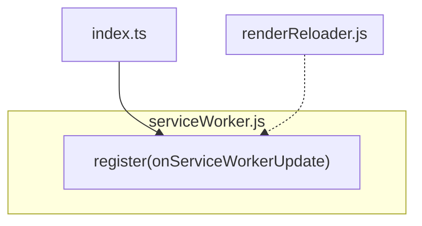

Service Worker registration on app starting up

```mermaid
graph TD

subgraph serviceWorker[serviceWorker.js]

register["register(onServiceWorkerUpdate)"]

end

subgraph renderReloader[renderReloader.js]

end

index[index.ts] --> register

renderReloader -.-> register

```
