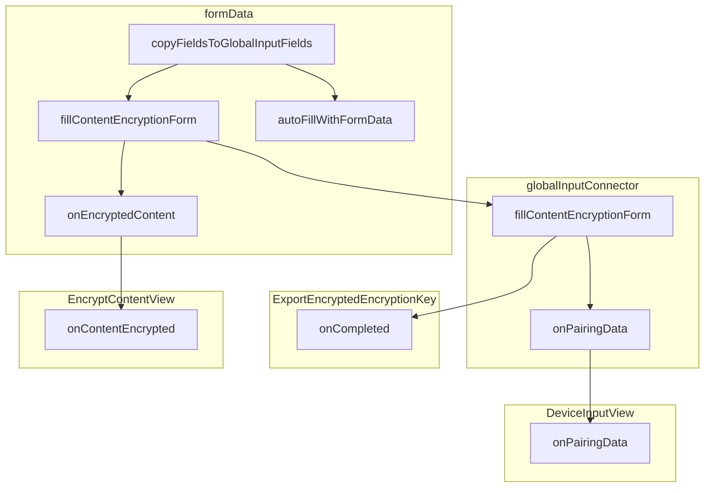

copyFieldsToGlobalInputFields



```javascript
const value = isEncrypted
  ? appStore.decryptContent(matchedFields[0].value)
  : matchedFields[0].value
```

copyFieldsToGlobalInputFields() returns an array of structure:

```javascript
{
  id, value, isEncrypted
}
```
